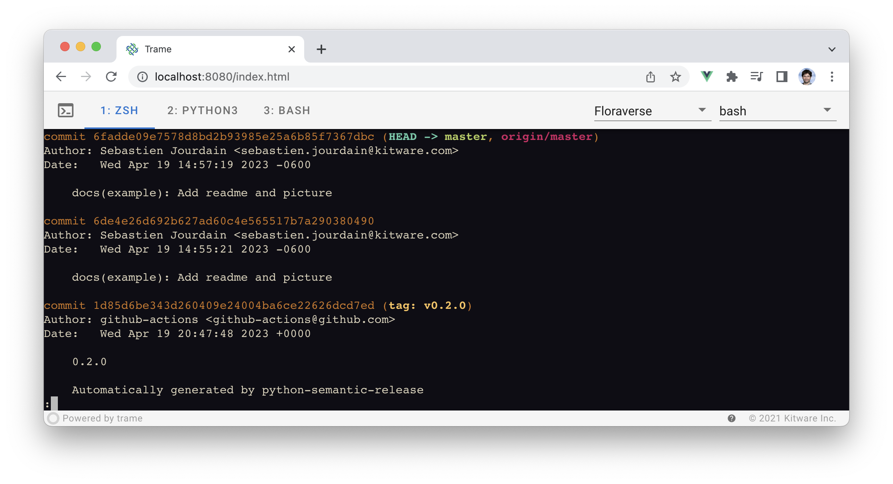
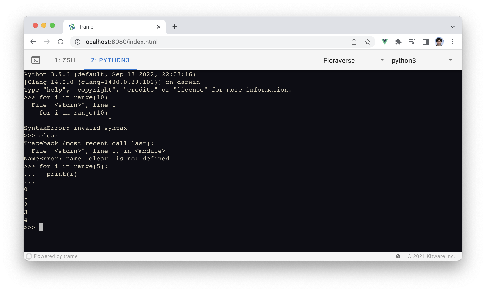
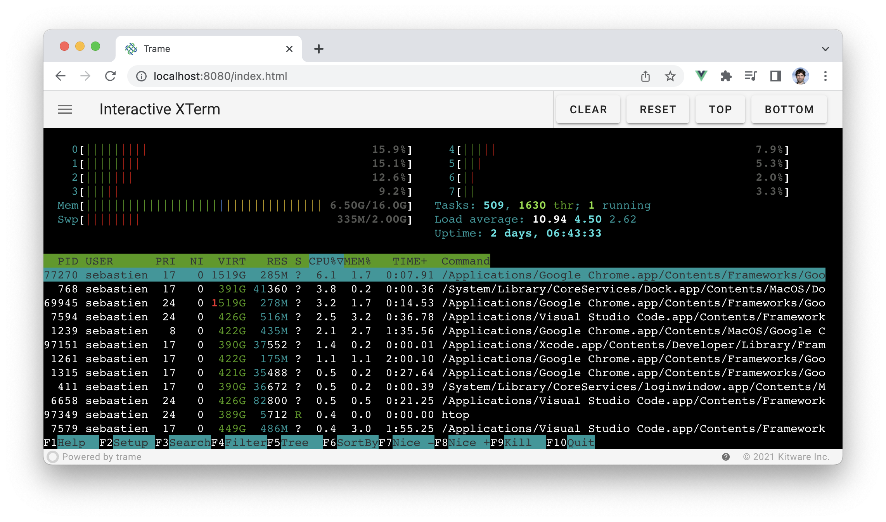

.. |pypi_download| image:: https://img.shields.io/pypi/dm/trame-xterm

trame-xterm |pypi_download|
===========================================================

Trame widget to expose xterm.js. This library is compatible with both vue2 and vue3.

License
-----------------------------------------------------------

This library is distributed under the MIT License (Same as xterm.js)

Usage Examples
-----------------------------------------------------------

Development
-----------------------------------------------------------

Build and install the Vue components

.. code-block:: console

    cd vue-components
    npm i
    npm run build
    cd -

Install the python library

.. code-block:: console

    pip install -e .

JavaScript dependency
-----------------------------------------------------------

This Python package bundle the ``xterm@5.1.0``, ``xterm-theme@1.1.0`` and ``xterm-addon-fit@0.7.0`` JavaScript libraries. If you would like us to upgrade it, `please reach out <https://www.kitware.com/trame/>`_.
