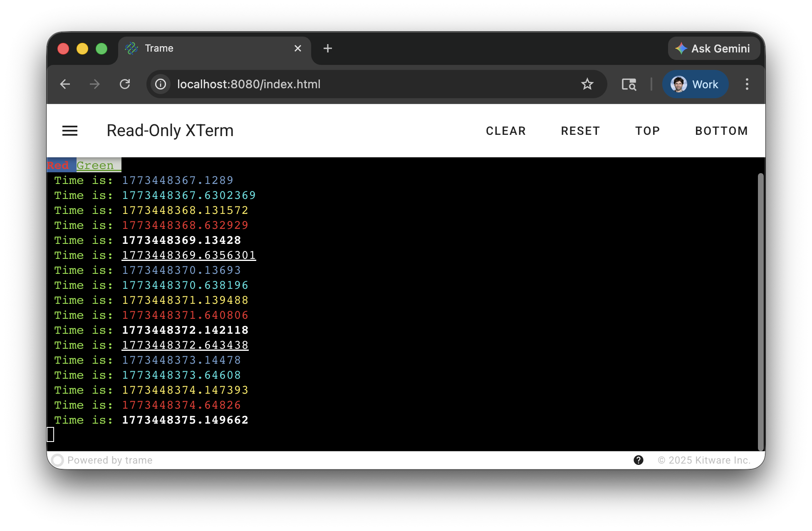
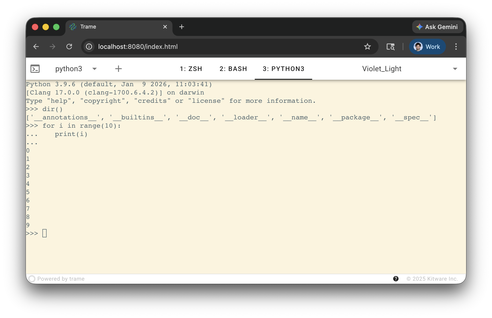
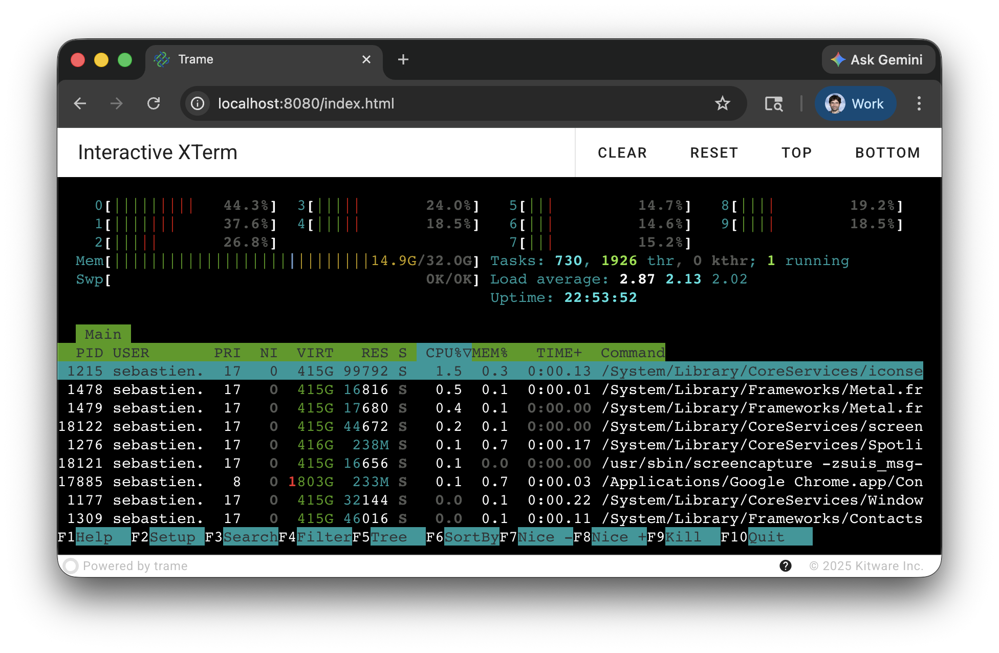

.. |pypi_download| image:: https://img.shields.io/pypi/dm/trame-xterm

trame-xterm |pypi_download|
===========================================================

Trame widget to expose xterm.js. This library is compatible with both vue2 and vue3.

License
-----------------------------------------------------------

This library is distributed under the MIT License (Same as xterm.js)

Usage Examples
-----------------------------------------------------------

Development setup
----------------------------------------

We recommend using uv for setting up and managing a virtual environment for your development.

.. code-block:: console

      # Create venv and install all dependencies
      uv sync --all-extras --dev

      # Activate environment
      source .venv/bin/activate

      # Install commit analysis
      pre-commit install
      pre-commit install --hook-type commit-msg

      # Allow live code edit
      uv pip install -e .

Build and install the Vue components

.. code-block:: console

      cd vue-components
      npm i
      npm run build
      cd -

For running tests and checks, you can run ``nox``.

.. code-block:: console

      # run all
      nox

      # lint
      nox -s lint

      # tests
      nox -s tests

Professional Support
----------------------------------------

* `Training <https://www.kitware.com/courses/trame/>`_: Learn how to confidently use trame from the expert developers at Kitware.
* `Support <https://www.kitware.com/trame/support/>`_: Our experts can assist your team as you build your web application and establish in-house expertise.
* `Custom Development <https://www.kitware.com/trame/support/>`_: Leverage Kitware’s 25+ years of experience to quickly build your web application.

JavaScript dependency
-----------------------------------------------------------

This Python package bundle the ``xterm@5.1.0``, ``xterm-theme@1.1.0`` and ``xterm-addon-fit@0.7.0`` JavaScript libraries. If you would like us to upgrade it, `please reach out <https://www.kitware.com/trame/>`_.
